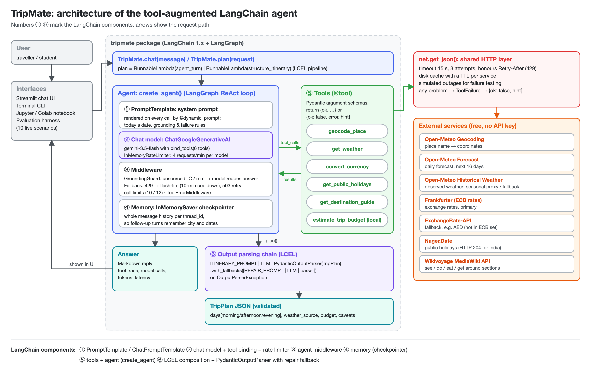
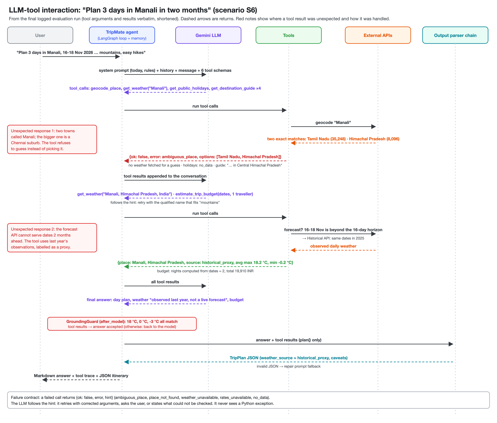

# TripMate: a tool-augmented travel-planning agent (LangChain + Gemini)

**PSIS Activity 2: Build a Tool-Augmented / Agentic LLM Application** · Generative AI · 16-30 September 2026

TripMate is a chat agent that plans trips. The LLM plans and writes, and **every fact that changes over time comes
from a real API that the LLM calls as a tool**: weather forecasts, exchange rates, public holidays and Wikivoyage
travel-guide content. The agent remembers the conversation. It reports failed or unexpected tool responses instead
of inventing data, and it can turn its answer into a validated JSON itinerary.



## Contents

| Path | What it is |
|---|---|
| `TripMate_Agent.ipynb` | **Main notebook**: walkthrough, live demo, failure handling, evaluation results (executed) |
| `tripmate/` | The application package (agent, tools, prompts, schema, HTTP layer) |
| `streamlit_app.py` | Chat UI used for the demo video (tool traces, outage switches, offline replay) |
| `cli.py` | Terminal chat |
| `tests/` | 41 offline unit tests (mocked APIs, scripted fake LLM) |
| `evaluation/` | 10 live test scenarios with automatic checks |
| `results/` | Test results (`test_results.md`/`.json`), full input/output transcripts (`sample_outputs/`), and earlier runs that exposed bugs (`HISTORY.md`) |
| `docs/` | Architecture and LLM-tool sequence diagrams (PNG + SVG + generator) |
| `deliverables/` | Phase 1 proposal, Phase 2 progress notes, Phase 3 report, contribution statement, video script, feedback form |

## LangChain components

| # | Component | Implementation | Purpose |
|---|---|---|---|
| 1 | **PromptTemplate / ChatPromptTemplate** | `tripmate/prompts.py`, rendered per call by `@dynamic_prompt` | Today's date, grounding rules and failure-handling rules; itinerary and repair prompts |
| 2 | **Tools + Agent** | six `@tool` functions (`tripmate/tools.py`) + `create_agent` (`tripmate/agent.py`) | The LLM decides which tools to call and when to stop |
| 3 | **Memory** | LangGraph `InMemorySaver` checkpointer, one `thread_id` per conversation | Follow-ups reuse the city, dates and earlier results |
| 4 | **OutputParser** | `PydanticOutputParser(TripPlan)` (`tripmate/schemas.py`) | Validated JSON itinerary |
| 5 | **LCEL composition** | `prompt \| llm \| parser`, `.with_fallbacks([repair chain])`, `agent_turn \| structure_itinerary` | Structured output with automatic JSON repair |
| 6 | **Middleware + rate limiter** | custom `GroundingGuardMiddleware` (weather figures in an answer must match a tool result, otherwise the model redoes the answer), custom `FallbackMiddleware` (HTTP 429 → `gemini-3.5-flash-lite`, exhausted model skipped for 10 min; 503 retried), `ModelCallLimitMiddleware`, `ToolCallLimitMiddleware`, `ToolErrorMiddleware`, `InMemoryRateLimiter` per model | Robust on the free Gemini tier (observed limits: 20 requests/day on gemini-3.5-flash, 5/minute on gemini-2.5-flash) |

## Tools and external APIs (all free, no API key)

| Tool | External service | Failure / unexpected-response handling |
|---|---|---|
| `geocode_place` | Open-Meteo Geocoding | `place_not_found` (lists the closest names); flags `ambiguous` when sizeable towns share a name (two Indian towns called Manali); ignores airports and parks and rejects small fuzzy matches |
| `get_weather` | Open-Meteo Forecast + Historical Weather | Refuses to guess between same-name towns (`ambiguous_place` + options); dates beyond the 16-day horizon return last year's observations labelled `historical_proxy`; a forecast outage falls back to history; if both fail, `weather_unavailable` |
| `convert_currency` | Frankfurter (ECB) → ExchangeRate-API | ECB has no AED rate (HTTP 404), so the fallback provider is used; `rates_unavailable` if both fail |
| `get_public_holidays` | Nager.Date | HTTP 204 (empty) for India becomes `no_data` with "this does NOT mean there are no holidays" |
| `get_destination_guide` | Wikivoyage MediaWiki API | `page_not_found`, `section_missing`, `ambiguous_destination`, HTTP 429 → honours `Retry-After` |
| `estimate_trip_budget` | local Python | Exact arithmetic on the LLM's unit-cost estimates; nights come from the trip dates, and a mismatch is noted |

All HTTP goes through `tripmate/net.py`: 15 s timeout, 3 attempts, `Retry-After` support, a disk cache with a TTL
per service, and **simulated outages** for testing. A tool never raises. It returns
`{"ok": false, "error", "message", "hint"}` and the system prompt tells the LLM to follow the hint.



## Setup

```bash
python3.12 -m venv .venv && source .venv/bin/activate      # Python 3.10+
pip install -r requirements.txt
cp .env.example .env        # then put your free key from https://aistudio.google.com/apikey in .env
```

**Google Colab:** upload the repository folder (or `git clone` your GitHub copy), `%cd` into it, run
`%pip install -r requirements.txt`, and open `TripMate_Agent.ipynb`. The notebook asks for the key with `getpass`.

## Run

```bash
streamlit run streamlit_app.py           # chat UI (demo)
python cli.py                            # terminal chat: /plan <request>, /outage forecast, /reset, /quit
jupyter notebook TripMate_Agent.ipynb    # walkthrough
```

```python
from tripmate import TripMate
bot = TripMate()
turn = bot.plan("Plan a 2-day trip to Udaipur next week for one person, budget in INR")
print(turn.answer)                    # Markdown answer
print(turn.tool_names)                # tools the agent called
print(turn.plan.model_dump_json())    # validated JSON itinerary
```

## Tests

```bash
python -m pytest                          # 41 offline tests, no key or network needed
python -m evaluation.run_evaluation       # 10 live scenarios (about 15 min on the free tier)
python -m evaluation.run_evaluation S6    # one scenario
python -m evaluation.run_evaluation --rescore   # re-apply checks to saved runs without API calls
```

<!-- RESULTS:START -->
## Results

Final live run (2026-09-17 11:41): **10/10 scenarios, 40/40 checks passed**, 53/55 numbers in answers traced to a tool result, tool argument or user message. Failed tool calls are expected in the failure scenarios.

| ID | Scenario | Result | Tools (failed) | Time (s) | Grounded numbers |
|---|---|---|---|---|---|
| S1 | Full trip plan (Jaipur) | PASS (7/7) | 6 (1) | 74.5 | 11/12 |
| S2 | Quick weather question (Tokyo weekend) | PASS (3/3) | 2 (0) | 34.6 | 3/3 |
| S3 | Currency conversion (USD to EUR and INR) | PASS (4/4) | 2 (0) | 20.4 | 5/5 |
| S4 | Multi-turn memory (Udaipur) | PASS (6/6) | 4 (0) | 80.1 | 17/18 |
| S5 | Unknown destination (tool returns place_not_found) | PASS (4/4) | 1 (1) | 30.6 | n/a |
| S6 | Dates beyond the forecast horizon (Manali in two months) | PASS (5/5) | 9 (2) | 62.5 | 14/14 |
| S7 | Unsupported currency, fallback provider (AED to INR) | PASS (2/2) | 1 (0) | 28.0 | 3/3 |
| S8 | Empty API response (India public holidays) | PASS (3/3) | 3 (2) | 60.6 | n/a |
| S9 | Weather service outage (simulated) | PASS (3/3) | 4 (3) | 59.6 | n/a |
| S10 | Off-topic request / prompt injection | PASS (3/3) | 0 (0) | 14.8 | n/a |

Full inputs and outputs: [`results/sample_outputs/`](results/sample_outputs/). Earlier runs exposed five problems:
a quota that doubled latency, a fuzzy geocoder match, 3-day plans budgeted for 3 nights, the wrong Manali, and
weather invented after a failed tool call. Each was fixed in code; see [`results/HISTORY.md`](results/HISTORY.md).
<!-- RESULTS:END -->

## Configuration (`.env`)

| Variable | Default | Meaning |
|---|---|---|
| `GEMINI_API_KEY` | required | Google AI Studio key |
| `GEMINI_MODEL` / `GEMINI_FALLBACK_MODEL` | `gemini-3.5-flash` / `gemini-3.5-flash-lite` | main and fallback chat models |
| `GEMINI_RPM` | `4` | client-side rate limit per model (requests per minute) |
| `TRIPMATE_HOME_CURRENCY` | `INR` | default budget currency |
| `TRIPMATE_SIMULATE_OUTAGE` | empty | e.g. `forecast,archive` to force failures |

## Limitations

* Hotel, food and transport prices are the LLM's estimates; only the arithmetic is exact.
* Same-name towns are refused only when the second town is at least a tenth the size of the first. A small but
  intended namesake still needs the agent to notice. States and regions (e.g. "Goa") are not in the geocoder.
* Non-numeric details (train times, restaurant names) can come from the model's memory; the grounding check
  covers only numbers.
* On the free tier a full plan takes 1-2 minutes, and daily quotas are small.
* Memory lives in the process and is lost on restart.

## Data sources and attribution

Wikivoyage text is CC BY-SA 4.0. Weather data © Open-Meteo (CC BY 4.0). Exchange rates from the ECB via
Frankfurter and from ExchangeRate-API (open access, attribution required). Holidays from Nager.Date.
